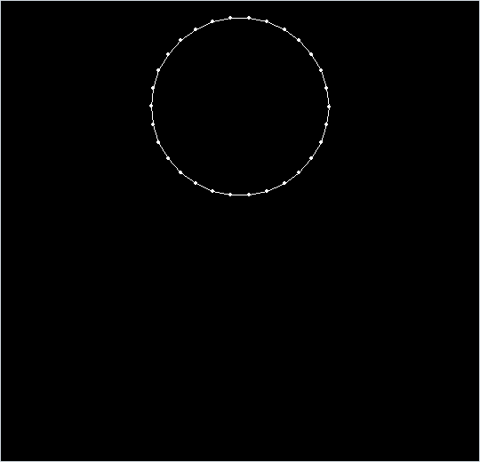

<div align="center">

# Soft Body Sim

*A ring of point masses, every pair joined by a damped spring, that falls and slumps onto the floor in Pygame.*




</div>

## About

A 2D soft-body experiment written from scratch, vector class included. The body is a ring of 30 point masses placed in polar coordinates, and every pair of points, not only neighbours, is joined by a damped spring: 435 springs in all. The ring drops under gravity, lands on a floor and slumps into a dome under its own weight. Only the outline is drawn. As a first step towards collisions between bodies, the outline edges crossed by a horizontal ray from the mouse cursor turn red, which is the crossing test behind point-in-polygon checks.

## Quick start

```bash
python -m pip install -r requirements.txt
python SoftBody.py
```

## Controls

| Input | Action |
| --- | --- |
| Move the mouse | Edges crossed by the ray to the right of the cursor turn red |
| Close the window | Quit |

## How it works

- **Building the body.** `softBodyPolar` takes (angle, radius) pairs and places each point at $(r\cos\theta,\ r\sin\theta)$ around the centre $(700, 400)$, here 30 points at radius 100. `softBody` then joins every pair with a `springJoint` whose rest length $L_0$ is the starting distance, so the $\binom{30}{2} = 435$ springs act as an internal scaffold that resists both stretching and shearing.
- **Spring force.** With $\mathbf d = \mathbf x_1 - \mathbf x_2$, Hooke's law along the spring plus damping on the relative velocity along it:

  ```math
  \mathbf F_1 = k\,\bigl(L_0 - \lVert \mathbf d \rVert\bigr)\,\hat{\mathbf d} \;-\; c\,\bigl(\mathbf d \cdot (\mathbf v_1 - \mathbf v_2)\bigr)\,\hat{\mathbf d},
  \qquad \mathbf F_2 = -\mathbf F_1
  ```

  with $k = 1$ and $c = 0.01$. The damping term uses $\mathbf d$ rather than $\hat{\mathbf d}$, so it also grows with the spring's length.
- **Integration.** Each point adds its weight $(0,\,-9.8\,m)$ to the spring forces and uses the sum directly as its acceleration. It then steps with semi-implicit Euler, where $\Delta t$ is the real time since the previous frame:

  ```math
  \mathbf v \leftarrow \mathbf v + \mathbf F\,\Delta t,\qquad \mathbf x \leftarrow \mathbf x + \mathbf v\,\Delta t
  ```

  The springs compute their forces after the points have moved, so those forces act on the next frame.
- **Floor.** The physics uses $y$ pointing up and the drawing flips it. A point that goes below $y = 10$ is put back at 10 and loses its vertical velocity, so nothing bounces. In a test run with a fixed 1/60 s step the 200 px ring touched the floor after about 2.4 seconds and settled about 167 px tall and 208 px wide.
- **Ray-cast edge test.** `segmentCollideSemirrect` ("segment meets half-line") intersects the line through an edge with the horizontal half-line running right from a point, and accepts the crossing only if the point's height lies strictly between the edge's endpoints. Counting the crossings gives the even-odd rule: an odd count means the point is inside the outline. `draw` applies it to the mouse position; `update` already counts crossings for the points of other soft bodies but does nothing with the count yet.

## Code map

| Path | Role |
| --- | --- |
| `SoftBody.py` | Main version: the 30-point ring, outline drawing, the mouse ray test and the unfinished body-to-body crossing count |
| `SoftBodyCollisions.py` | Earlier, simpler variant despite its name: no collision code, an 8-point ring with $k = 10$ and all 28 springs drawn as a mesh |

## Limitations

- There is only one body and no collisions apart from the floor: bodies cannot touch each other yet, and nothing stops points at the sides of the window.
- Mass only scales the weight. Forces are not divided by mass, so a heavier point is pulled down harder but is no harder to accelerate.
- $\Delta t$ is the wall-clock frame time in an uncapped loop. The first step also includes the window start-up time, and a stiffer $k$ or a stall can make the integration unstable.
- The ray test divides by zero if an outline edge ever becomes exactly vertical.
- The body is drawn twice every frame, which is harmless but wasted work.

---

<div align="center"><sub>Part of <a href="https://github.com/lnivan">lnivan's projects</a> · <b>Simulations</b></sub></div>
